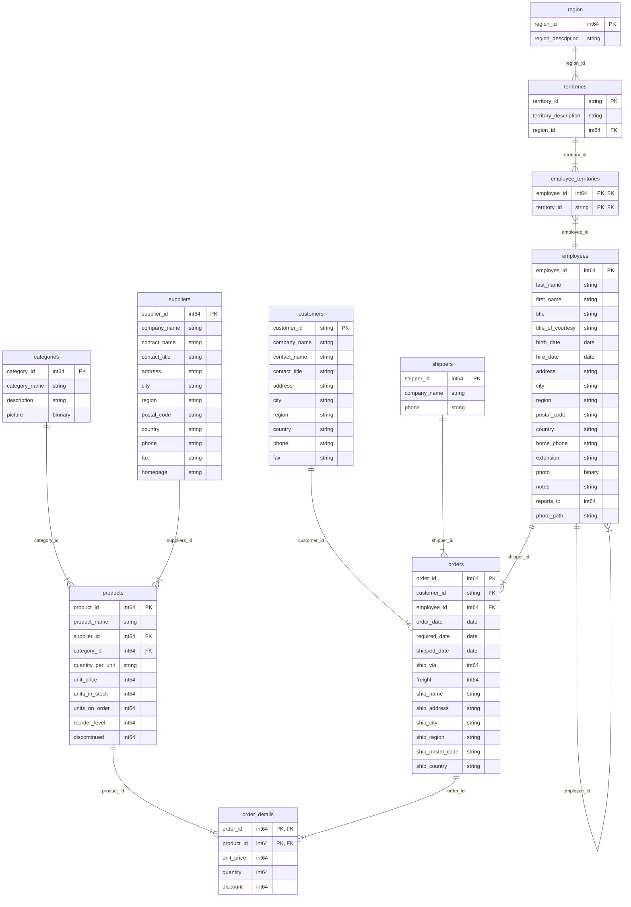

Northwind サンプルデータは、Microsoft 社が作成した特殊食品の輸出入企業「Northwind Traders」の架空の販売データを含む教材用データベースで、長年にわたり様々なデータベース製品の学習に活用されている。

```mermaid
erDiagram

orders ||--|{ order_details : order_id
products ||--|{ order_details : product_id
categories ||--|{ products : category_id
suppliers ||--|{ products : suppliers_id
customers ||--|{ orders : customer_id
shippers ||--|{ orders : shipper_id
employees ||--|{ orders : shipper_id
employees ||--|{ employees : employee_id
employee_territories }|--|| employees : employee_id
territories ||--|{ employee_territories : territory_id
region ||--|{ territories : region_id

products {
    product_id int64 "PK"
    product_name string
    supplier_id int64 "FK"
    category_id int64 "FK"
    quantity_per_unit string
    unit_price int64
    units_in_stock int64
    units_on_order int64
    reorder_level int64
    discontinued int64
}

categories {
    category_id int64 "PK"
    category_name string
    description string
    picture binnary
}

suppliers {
    supplier_id int64 "PK"
    company_name string
    contact_name string
    contact_title string
    address string
    city string
    region string
    postal_code string
    country string
    phone string
    fax string
    homepage string
}

customers {
    customer_id string "PK"
    company_name string
    contact_name string
    contact_title string
    address string
    city string
    region string
    country string
    phone string
    fax string
}

orders {
    order_id int64 "PK"
    customer_id string "FK"
    employee_id int64 "FK"
    order_date date
    required_date date
    shipped_date date
    ship_via int64
    freight int64
    ship_name string
    ship_address string
    ship_city string
    ship_region string
    ship_postal_code string
    ship_country string
}

order_details {
    order_id int64 "PK, FK"
    product_id int64 "PK, FK"
    unit_price int64
    quantity int64
    discount int64
}

shippers {
    shipper_id int64 "PK"
    company_name string
    phone string
}

employees {
    employee_id int64 "PK"
    last_name string
    first_name string
    title string
    title_of_courtesy string
    birth_date date
    hire_date date
    address string
    city string
    region string
    postal_code string
    country string
    home_phone string
    extension string
    photo binary
    notes string
    reports_to int64
    photo_path string
}

employee_territories {
    employee_id int64 "PK, FK"
    territory_id string "PK, FK"
}

territories {
    territory_id string "PK"
    territory_description string
    region_id int64 "FK"
}

region {
    region_id int64 "PK"
    region_description string
}
```
